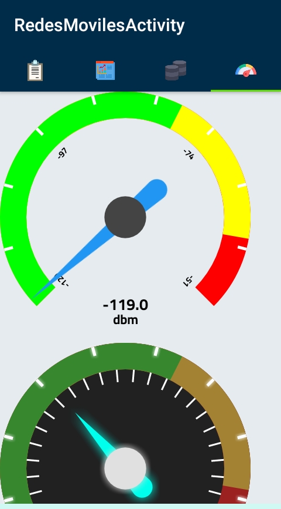
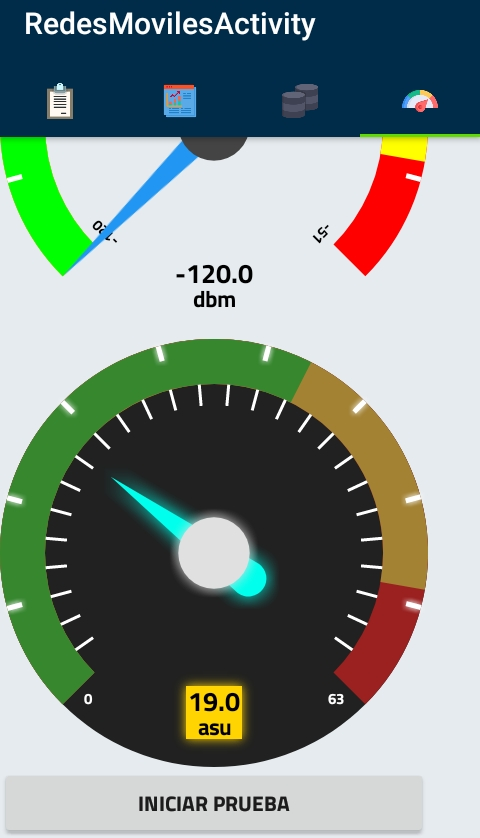
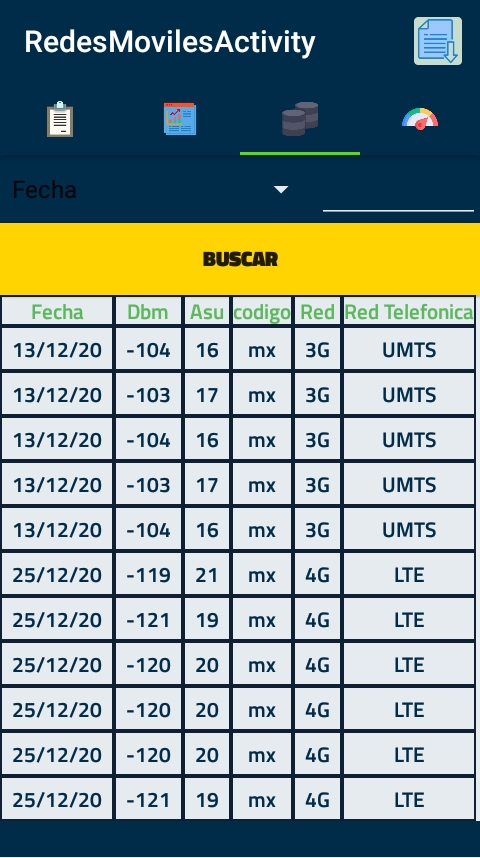
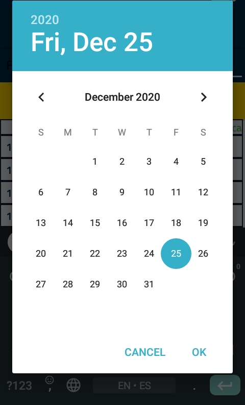
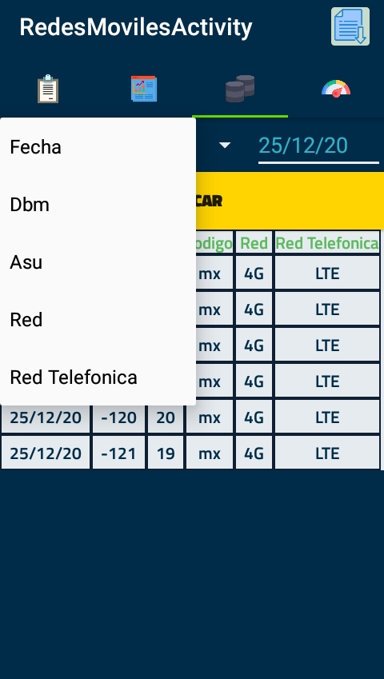
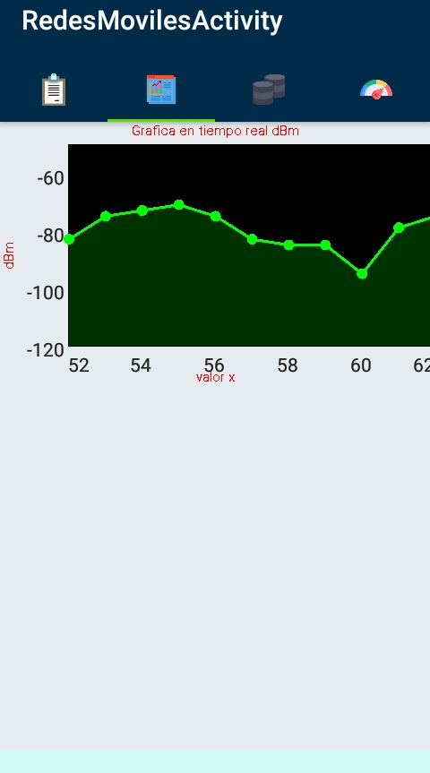
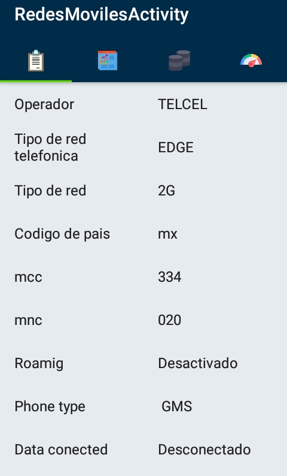

# SmartMobileNetworks

Proyecto realizado por Emmanuel Eduardo López Díaz y Guadalupe Orlando López Diaz, estudiantes del Instituto Tecnológico 
Superior de Loreto como proyecto de Practicas Profesionales las cuales estaran realizando en la empresa LASEC Telecomunicaciones
SAPI De CV, cumpliendo un minimo de 500 horas en un lapso de 4 a 6 meseses.

Se desarrollara una Aplicacion movil para medir la intensidad de señal en redes 2G, 3G y 4G a la cual hemos llamado 
"Smart Mobile Networks", sera compatible con Dispositivos Moviles con SO Android v5.1(Lollilop) en adelante

### Caracterizticas

- Mostrar información general sobre el estado de la red móvil del dispositivo que cambia en tiempo real
- Gráficas en tiempo real que muestran el nivel en asu y dbm
- Sección de pruebas en la que se realizan pruebas que se almacena en la Base de Datos
- Historial de pruebas que muestra en una tabla todos los resultados de las pruebas realizadas, se puede filtrar por fecha, dbm, asu y red
- Se puede exportar todos los registros guardados en el historial de pruebas a un archivo Excel

### Video de demostracion
https://www.youtube.com/watch?v=LYaoJln_7FA
    

### Librerías y Tecnologías utilizadas
- Java
- SQLite
- [SpeedView](https://github.com/anastr/SpeedView)
- [GraphView](https://github.com/jjoe64/GraphView)
- [SQLite2XL](https://github.com/androidmads/SQLite2XL)

### Capturas

  
  
  
  
  
  
  

